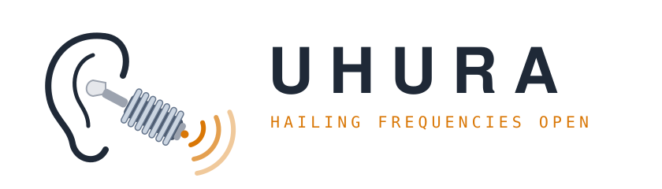

<p align="center">
  
</p>

# Uhura

**Your AI assistant can now make the phone call.**

AI assistants can research, write and plan, but some things still only happen on the
phone: the doctor's office without online booking, the travel agency that answers emails
slowly, the shop that won't say on its website whether it's open on Friday.

Uhura closes that gap. Ask Claude, or any assistant that speaks MCP, to make the call: it
drafts the briefing, you approve it, and an AI voice agent places the call. The agent
introduces itself as an AI and works through your questions. If it lacks an answer, it
asks you while the person waits on the line. You get the transcript, and what the call
cost.

Uhura is a small self-hosted service in front of
[ElevenLabs Agents](https://elevenlabs.io/docs/eleven-agents/overview). It works from your
AI assistant through MCP, or from the command line. One instance can serve one person on a
laptop or several people from a server.

**Status (2026-10-04):** built and verified against a real ElevenLabs account. Real phone
calls work through a Twilio number, in German, including a company's phone menu and a
waiting queue the agent sits through silently; progress reports and the cost of each call
are verified on real calls too. Asking you a question during a spoken call has so far only
been verified in text conversations, and no English call has been made yet. See
[docs/verified.md](docs/verified.md).

## How a call works

1. **Draft.** Give the number, the language, the goal and the facts the agent may share.
   Uhura checks the number and shows the exact briefing. Nothing is dialled.
2. **Rehearse** (optional). Talk to the real agent in text, playing the person being
   called, to see how it handles the briefing.
3. **Confirm.** A separate step dials.
4. **Follow and steer.** The agent reports progress as it goes (menu, queue, person
   reached, answers). If it lacks an answer, it asks you and waits on the line for your
   reply. Instructions you send reach it with its next check-in, at the latest just
   before it hangs up.
5. **Result.** The transcript, duration and cost in ElevenLabs credits are stored; no
   audio is kept.

```console
$ uhura draft --to "030 23125 000" --principal "Erika Musterfrau" --language de \
    --topic "eine Frage zu Ihren Öffnungszeiten" \
    --goal "Ask whether the shop is open on Friday."
Message composed, Captain. Awaiting your order to transmit.
  call id : 74b8167429cf
  number  : +493023125000
  opening : Guten Tag, hier spricht ein KI-Assistent im Auftrag von Erika Musterfrau. …
  after menu: Guten Tag, ich bin ein KI-Assistent … Es geht um eine Frage zu Ihren Öffnungszeiten. …

$ uhura rehearse 74b8167429cf      # text conversation, nobody is called
$ uhura confirm 74b8167429cf       # dials, follows the call, prompts for answers
Hailing frequencies open.
```

The brief can be in English; the agent speaks the call's language (`--language`, German
here) and always opens with the fixed disclosure line for it. The topic completes the
sentence "Es geht um …" in the line the agent says to the first person it reaches after a
phone menu or queue, so it is written in the call's language.

## Responsible use

Uhura places real phone calls to real people, with an AI voice. It is meant for calls you
would otherwise make yourself: asking a shop, a doctor's office or a travel agency
something on your own behalf. It is not meant for marketing, mass calling, surveys, or
anything that hides that an AI is calling or on whose behalf.

The guardrails below are built for that use: every call opens with a fixed disclosure,
each call is drafted and confirmed separately, and the limits keep volume low. They are
not a licence to call anyone about anything. You are responsible for the calls you place
and for the laws that apply to them. [docs/legal-notes.md](docs/legal-notes.md) records the
reasoning for Germany only; it is not legal advice, and other countries' rules on
automated calls, recording and transcription differ.

## Guardrails

Enforced by the service, whatever the briefing says:

- Drafting never dials, and a draft can be confirmed only once.
- Emergency, premium-rate, shared-cost and service numbers are refused.
- Only countries in `UHURA_ALLOWED_COUNTRIES` can be called.
- Per person: `UHURA_DAILY_CALLS` calls per 24 hours and `UHURA_MONTHLY_MINUTES` per 30 days.
  A call is only dialled if the minutes left cover the longest call the agent will make
  (20 minutes); calls still running count at that length until their result arrives.
- Per person: `UHURA_DAILY_REHEARSALS` rehearsals per 24 hours, each closed after 10 minutes.
- The opening line is fixed per language. It says that an AI is calling, for whom, and
  that the call is transcribed, and asks for agreement. A briefing cannot change it.
- People only see their own calls. Calls and transcripts are deleted after
  `UHURA_RETENTION_DAYS`.
- The service does not start with placeholder or short tokens or tool secret (fewer than
  16 characters), since it is usually reachable from the internet.

Asked of the agent through its fixed rules (reliable in tests, but a language model
follows them, it is not forced to): information only, no bookings or payments; end the
call if the person objects to transcription; ask instead of inventing facts; in phone menus,
press keys toward the goal and never agree to a recording; stay silent on hold; give the
fixed, short re-introduction (shown in the draft) to the first person reached after a menu
or queue; keep turns short and do not repeat the briefing.

## Quick start

```sh
uv sync
cp .env.example .env        # add your ElevenLabs key, invent a token and a tool secret
uv run uhura setup-agent    # creates the agent; put the printed id into .env
uv run uhura serve          # http://127.0.0.1:8787
uv run uhura check          # tells you what is still missing
```

The full walk-through, including the phone number, the public address the agent's tools
need, Docker and hosting for several people, is in [docs/setup.md](docs/setup.md).

## Commands

| Command | What it does |
|---|---|
| `uhura serve` | Run the service |
| `uhura setup-agent` | Create or update the agent in your ElevenLabs account |
| `uhura setup-tools [--url URL]` | Point the agent's tools at the service's public address (default: local ngrok tunnel) |
| `uhura check [--rehearsal]` | Verify the setup; with `--rehearsal`, run a scripted conversation |
| `uhura draft …` | Prepare a call and show the briefing |
| `uhura rehearse ID` | Try a draft in text against the real agent |
| `uhura confirm ID` | Dial, follow the call, answer its questions |
| `uhura watch ID` | Follow a call that is already running |
| `uhura say ID "text"` | Queue a follow-up instruction |
| `uhura show ID` / `uhura list` | Transcript, status and cost / recent calls |

## Use from an MCP client

```sh
claude mcp add --transport http uhura http://localhost:8787/mcp \
  --header "Authorization: Bearer <token>"
```

The service serves the tools itself at `/mcp`. For clients that can only start a local
program there is a stdio adapter, `uhura-mcp`; see [docs/operations.md](docs/operations.md).

Tools: `draft_call`, `confirm_call`, `wait_for_event`, `answer`, `send_instruction`,
`get_call`, `list_calls`, `rehearse_call`, `rehearse_say`, `end_rehearsal`. The server
tells the client to show every draft to the user and to confirm only after approval.

## Documentation

- [docs/setup.md](docs/setup.md): installation, accounts, phone number, hosting
- [docs/operations.md](docs/operations.md): starting a session, making calls, MCP in Claude Code, costs, troubleshooting
- [docs/architecture.md](docs/architecture.md): how it works, HTTP API, events, stored data
- [docs/verified.md](docs/verified.md): what has been tested against the real services and what has not
- [docs/roadmap.md](docs/roadmap.md): possible improvements, not built yet
- [docs/legal-notes.md](docs/legal-notes.md): the reasoning behind disclosure and transcript-only (Germany; not legal advice)

## Development

```sh
uv run pytest          # no network needed
uv run ruff check .    # lint
uv run ruff format .   # format
```

## The name

Lieutenant Nyota Uhura is the communications officer of the USS Enterprise in *Star Trek*,
played by Nichelle Nichols. She opens channels, hails other ships and relays what they say
to the captain. Uhura does the same job for you: it places the call, passes the agent's
questions to you and your answers back. Its status lines, from "Hailing frequencies open."
to "Channel closed.", are in her voice and live in `src/uhura/phrases.py`. The ribbed earpiece
in the banner is a nod to the one she wore on the bridge.

## License

[MIT](LICENSE).
