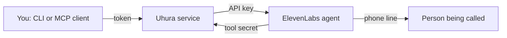

# Architecture

## Pieces

- **Uhura service** (`src/uhura/service.py`): the only place that holds the ElevenLabs key.
  It drafts calls, applies the guardrails, starts calls, relays questions and stores results
  in SQLite.
- **ElevenLabs agent**: one generic agent per account. Each call hands it a briefing, an
  opening line and a language as per-call overrides.
- **Agent tools**: two webhooks the agent calls during a conversation, `ask_principal` and
  `final_check`. They are how anything gets from you into a running call.
- **Clients**: the CLI (`cli.py`) and the MCP tools (`mcp_server.py`). Both are thin HTTP
  clients of the service (`api_client.py`) and hold only a user token. The MCP tools are
  served by the service itself at `/mcp`, where each tool calls the service's own API
  in-process with the caller's token, and by the stdio adapter `uhura-mcp`, which calls
  it over the network.

## Lifecycle of a call

| Status | Meaning | Next |
|---|---|---|
| `draft` | Checked and stored, not dialled | `rehearsing`, `dialling` |
| `rehearsing` | A text conversation with the agent is open | back to `draft` |
| `dialling` | Confirmed; waiting for ElevenLabs to accept the call | `in_progress`, `failed` |
| `in_progress` | Dialled; the service polls ElevenLabs for the result | `done`, `failed` |
| `done` | Finished; transcript and duration stored | |
| `failed` | Could not be started, or the provider reported failure, or no result arrived within `max_call_seconds` | |

After a restart the service resumes polling for calls that were `in_progress` and puts
`rehearsing` calls back to `draft`. A call that was `dialling` is marked `failed`: it may
have gone through, so it is never dialled again. So is an `in_progress` call without an
ElevenLabs conversation id, since there is nothing to ask ElevenLabs about. If storing a
call's result fails, the call is marked `failed` with the reason and `call_ended` is still
sent, so waiting clients are never left hanging.

Moving a call out of `draft` is a single conditional database update, so of two requests
that confirm or rehearse the same draft at once, only one succeeds. An answer is accepted
only on the call whose agent asked the question.

## Steering

**The agent asks you.** The agent calls `ask_principal` with a question. The service
records a `question` event and holds the HTTP request open. When someone posts an answer,
the request returns it and the agent continues. If nobody answers within
`UHURA_ASK_TIMEOUT`, the request returns a fallback telling the agent to say that the
principal will follow up by email.

**You instruct the agent.** `POST /calls/{id}/instructions` queues a text. The service
cannot push into a running call, so queued instructions ride along in the result of the
agent's next tool call. The agent's rules make it call `final_check` before it says
goodbye, which bounds the delay: an instruction arrives during the call or at its end,
but not at a moment you choose. Pushing immediately would need ElevenLabs' enterprise
monitoring feature or routing the call audio through the service.

**Clients wait by long-polling.** `GET /calls/{id}/events?after=N&timeout=T` returns as
soon as there is an event with a sequence number above `N`, or an empty list after `T`
seconds. The MCP tool `wait_for_event` wraps this. It is a plain tool call, so it works in
any MCP client; MCP's own mechanism for asking the user (elicitation) is not used yet.

## Progress and cost

ElevenLabs gives no insight into a phone call while it runs (no live transcript without
its Enterprise monitoring). The agent therefore reports milestones itself with the
webhook tool `report_progress`: a menu key pressed, put on hold, a person reached, an
answer to one of the goal's questions, about to say goodbye. The tool runs
asynchronously and without speech, so nobody on the line notices. Each report is one
small language-model step. Reports are on unless `UHURA_PROGRESS=off` or the brief sets
`progress: false`; the brief's value decides whether the rule is in the briefing, and the
service ignores reports for calls that have it off. Each moment that needs a report is
named in the rule the agent follows at that point (menu, hold, agreement, answers,
goodbye), and a report identical to the previous one is stored only once, since
ElevenLabs sometimes delivers the same tool call twice.

When a call ends, the service stores what ElevenLabs charged for it as `cost`: credits,
billed minutes after the silence discount, and ElevenLabs' dollar prices for the voice
platform and the language model. Rehearsals are not included yet.

## Rehearsal

A rehearsal opens a text-only conversation with the same agent over ElevenLabs'
WebSocket API, with the same briefing and the same tools as a real call. The service
turns the conversation into events, so clients follow it exactly like a call. It does not
count against the call limits, but it does use ElevenLabs credits, so it has its own:
`UHURA_DAILY_REHEARSALS` per person and day, and the service closes a rehearsal that is
still open after `max_rehearsal_seconds` (10 minutes).

## Budget

The limits are checked when a call is confirmed. The daily limit counts calls dialled in
the last 24 hours; one that fails to start is not counted. The monthly budget counts the
durations ElevenLabs reports for the last 30 days. A call without a result yet (dialling
or in progress) counts as 1200 seconds, the agent's maximum call length, and a new call is
only dialled if 1200 seconds are left. A call the service gave up waiting for counts as
the time since it was dialled, up to 1200 seconds.

## Phone menus and waiting queues

The agent has ElevenLabs' built-in tools `play_keypad_touch_tone`, to press keys in a
phone menu (set to stay quiet after a key press), and `skip_turn`, to say nothing until
the other side speaks again. Its rules tell it to choose menu options that fit the goal,
never to agree to a recording, to stay silent on hold instead of asking whether anyone
is there, and to say a fixed re-introduction (`REINTRODUCTIONS` in `disclosures.py`,
with the brief's `topic`) word for word to the first person it reaches. The wording is
fixed in code and shown in the draft; that the agent says it is a prompt rule, not
enforced by code. Silence of more than 10 seconds is billed at 5% of
the per-minute rate, so waiting quietly costs little; the agent's maximum call length is
20 minutes to leave room for queues.

## Events

Each has `seq`, `type`, `at` and type-specific fields.

| Type | When | Fields |
|---|---|---|
| `call_started` | Dialled | `message` |
| `question` | Agent called `ask_principal` | `question`; answer with this event's `seq` |
| `answered` | Someone answered | `question_id`, `answer` |
| `question_expired` | Nobody answered in time | `question_id` |
| `instruction_queued` | A follow-up was queued | `text` |
| `call_ended` | Result stored | `status`, `message` |
| `rehearsal_started`, `rehearsal_ended` | Rehearsal opened or closed | `message`; `reason` if closed by the time limit |
| `agent_said`, `callee_said` | Rehearsal only: one turn of the conversation | `text` |
| `tool_used` | Rehearsal only: the agent used a tool | `name`, `ok` |
| `progress` | The agent reported progress (if the call has `progress` on) | `stage` (`menu`, `hold`, `talking`, `wrapping_up`), `note` |

## HTTP API

User endpoints need `Authorization: Bearer <token>`.

| Method and path | Purpose |
|---|---|
| `GET /health` | Liveness, no authentication |
| `POST /calls` | Draft a call from a brief (`to`, `principal`, `goal`, `language`, `facts`, `must_not`, `region`, `voicemail`, `topic`, `progress`) |
| `GET /calls` | Your recent calls |
| `GET /calls/{id}` | Status, briefing, transcript, cost |
| `POST /calls/{id}/confirm` | Dial |
| `GET /calls/{id}/events` | Long-poll for events |
| `POST /calls/{id}/answer` | Answer a question (`question_id`, `text`) |
| `POST /calls/{id}/instructions` | Queue a follow-up (`text`) |
| `POST /calls/{id}/rehearsal` | Start a rehearsal |
| `POST /calls/{id}/rehearsal/say` | Speak as the person being called (`text`) |
| `DELETE /calls/{id}/rehearsal` | End the rehearsal |
| `POST /mcp` | The MCP tools over streamable HTTP, stateless |

Agent endpoints need the header `X-Uhura-Secret` and only work for calls that are
`in_progress` or `rehearsing`.

| Method and path | Purpose |
|---|---|
| `POST /agent-tools/ask_principal` | `call_id`, `question`; blocks until answered or timed out |
| `POST /agent-tools/final_check` | `call_id`; returns queued instructions |
| `POST /agent-tools/report_progress` | `call_id`, `stage`, `note`; stored as a `progress` event only if the call has `progress` on |

Interactive API documentation is served at `/docs` by the running service.

## What is stored where

| Where | What | How long |
|---|---|---|
| Uhura's SQLite file | Brief, number, briefing, events (including progress notes), transcript, duration, cost | `UHURA_RETENTION_DAYS` |
| ElevenLabs | Conversation transcript and metadata; no audio (`record_voice` off) | ElevenLabs' retention setting, unlimited by default |
| ElevenLabs secret store | The tool secret | Until changed |
| The language-model provider | The conversation text, as processed by the model chosen in `UHURA_LLM` | Per that provider's terms |

Uhura does not yet shorten ElevenLabs' own transcript retention.

## Code map

| File | Role |
|---|---|
| `service.py` | HTTP API and `CallManager` (lifecycle, steering, rehearsal, recovery, purge) |
| `elevenlabs.py` | ElevenLabs client: outbound call, conversation result, text session |
| `guardrails.py` | Number checks and budgets |
| `prompt.py`, `disclosures.py` | The agent's fixed rules and the fixed opening lines |
| `store.py` | SQLite persistence |
| `setup_agent.py` | Agent, tools and secret setup |
| `check.py` | `uhura check` |
| `cli.py`, `mcp_server.py`, `api_client.py` | Clients |
| `phrases.py` | Uhura's status lines |
